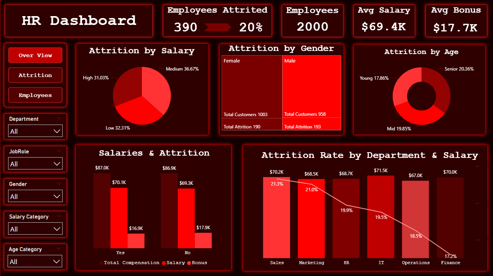

# Employee Attrition Analysis

## Project Objective

This project is an exploratory data analysis (EDA) on a company's HR dataset focused on understanding employee attrition. The analysis explores who is leaving, which departments have the highest attrition, how salary relates to turnover, and how demographics like age and gender distribute across the workforce.

---

## Dataset Description

The dataset is covering demographics, compensation, job roles, departments, education levels, and attrition status. Two calculated categories were added during cleaning — salary range groups and age groups to support segmentation analysis.

---

## Tools Used

- **Power BI** : Interactive dashboard with slicers and KPI cards
- **Power Query** :  Data cleaning and transformation pipeline

---

## Data Cleaning

The dataset had significant quality issues that required thorough cleaning.

### Cleaning Tasks Performed

- Removed duplicate rows and duplicate employee IDs
- Fixed multiple misspellings and inconsistent values
- Replaced null values across key columns
- Corrected negative salary and compensation values
- Imputed missing salaries using department averages
- Recalculated total compensation where values were missing
- Added salary category groups
- Added age category groups

---

## Exploratory Data Analysis

### Overall Workforce

- Total Employees: **2,000**
- Employees Stayed: **1,570**
- Employees Left: **390**
- Retention Rate: **79%**
- Attrition Rate: **20%**
- Average Salary: **$69.4K**
- Average Bonus: **$17.7K**

The company has a relatively stable workforce, although one in five employees has left.

### Attrition by Salary

- Medium Salary: **36.67%**
- Low Salary: **32.31%**
- High Salary: **31.03%**

Employees who left earned an average salary of **$70.1K**, compared to **$69.3K** for employees who stayed.

### Attrition by Department

- Sales: **21.3%**
- Marketing: **21.0%**
- HR: **19.9%**
- IT: **19.5%**
- Operations: **18.5%**
- Finance: **17.2%**

Attrition is distributed fairly evenly across departments.

### Attrition by Gender

- Male Attrition: **193 employees (50.39%)**
- Female Attrition: **190 employees (49.61%)**

Gender does not appear to be a significant attrition factor.

### Attrition by Age

- Mid (31–45): **160**
- Senior (46+): **147**
- Young (<31): **83**

Mid age employees have the highest attrition count.

### Employee Distribution

- HR: **347**
- Marketing: **333**
- IT: **323**
- Finance: **320**
- Operations: **319**
- Sales: **319**

The workforce is distributed fairly evenly across departments.

### Demographics

- Male Employees: **51.1%**
- Female Employees: **48.9%**

Age Distribution:

- Mid: **809**
- Senior: **728**
- Young: **463**

The workforce is primarily composed of experienced employees.

---

## Key Insights

- 1 in 5 employees left the company, resulting in a 20% attrition rate.
- Salary is not the primary driver of attrition.
- Attrition is spread across all departments rather than concentrated in one area.
- Mid-career employees (31–45) experience the highest attrition.
- Gender has minimal impact on attrition patterns.
- Sales records the highest attrition rate among departments.
- Extensive data cleaning was required before meaningful analysis could be performed.

---

## Conclusion

This project analyzes employee attrition across 2,000 records using a heavily cleaned HR dataset. The analysis reveals that attrition is a company-wide challenge rather than a problem isolated to a single department or demographic group.
